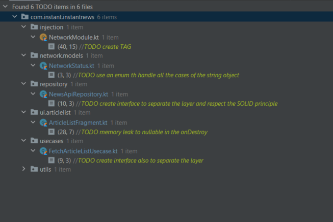

# InstantNews

#Project
J'ai effectué ce project en environ un peu moins de 5h30 avec quelques pauses que vous pourrez retrouver dans le github( j'ai créé des branch feature et des tags avec des horaires normalement),
je me suis beaucoups attardé sur les parties back(network,data,business logic) et beaucoup moins sur les partie front(presenter,viewModel).

#Choix Technique
* Utilisation d'un repository afin d'avoir un SSOT
* Dependancy injection pour créer nos modules network et repo
* Navigation component + safeArgs to handle the passing of data between fragment
* Utilisation de coroutine combiné au flow afin d'avoir la possiblité de compute dans le futur des data sur different thread
* Moshi préféré à GSON car plus stable dans la gestion des élements nulls + plus adatpé au Kotlin
* MVVM + Clean architecture
* Pas de JetPackCompose mais migration possible
* Migration également possible d'Adapter en ListAdatpter avec DiffUtil

#Problème non traité mais identifié
* Improvement pour la sécurité de la key utilisé un fichier native c++, BuildConfig n'est pas suffisant
* Utilisation de Ktor comme systeme de networking car beaucoup plus adapté au Kotlin
* Approfondissement des test unitaires en testant notamment les cas d'erreurs et le repository
* Meilleurs gestions des cas d'érrreurs(Pop up ou écran générique)
* Improvement de la UI en utilisant des styles et des thèmes et aussi des barriers pour l'écran de détails 
* Utilisation des fonctions de Glide avancées afin de garder mieux en cache les images, le scroll de la recyclerview recrée les items et parfait les resize may use DiffUtils
* Save the current position of the iten when go on the DetailsScreen
* TODO list of element to improve 

#Ressenties
Je me suis sentie à l'aise sur toutes les parties malgré quelques problèmes,
je n'ai malheureusement pas pu faire tout ce que je voulais notamment bien développer les TU ou encore développer une UI beaucoup plus moderne 
  

